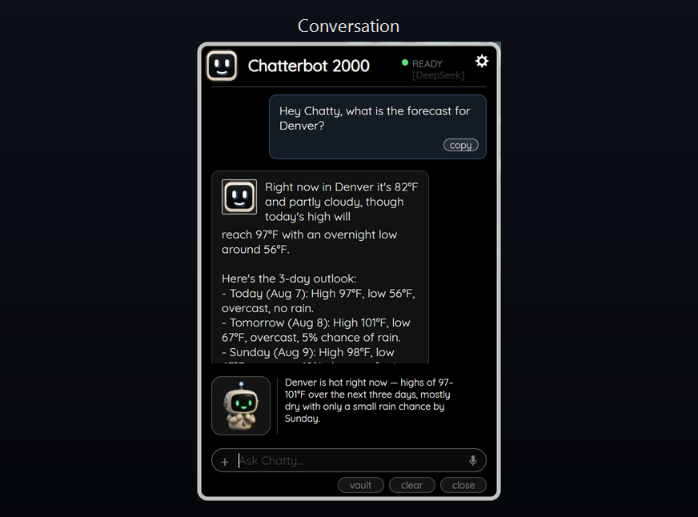

# Chatterbot 2000

**A friendly little robot for your Windows desktop.** Ask him something and he
answers in place — no browser tab, no sign-up, and nothing to pay us, ever.

Chatterbot 2000 is a **standalone Windows app** — one file, double-click, done —
and also a **Rainmeter skin** if you want a true desktop widget. It talks to any
OpenAI-compatible model, including one running on your own machine, so you bring
your own key — or no key at all.

**Download: [chatterbot2000.com](https://chatterbot2000.com)** · installers are
published under [Releases](../../releases).

---

## What it does

- **Free, and actually free.** No trial, no account, no time limit.
- **Bring your own API key.** Your provider, your account — we never see it.
- **Drop in images and files.** Hit `+` and Chatty reads them.
- **Talk instead of typing.** Voice to text, built in.
- **Private vault & memory.** It remembers what matters, on your disk.
- **Live weather.** Real conditions and a 3-day forecast for any city, from
  Open-Meteo. No key required, ever.
- **Live web search.** The model decides when to look something up, and the
  sources are listed under the answer.
- **Knows what day it is.** The date goes into every request, so it will not
  hand you a two-year-old result and call it current.
- **Runs fully local if you want.** Pick Ollama or LM Studio and there is no
  key, no account, and nothing leaves your machine.

## Install

1. Download the installer from **[chatterbot2000.com](https://chatterbot2000.com)**
   or from [Releases](../../releases).
2. Double-click it. It installs for your user only and never asks for admin.
3. The status light starts **red** — no provider is configured yet.
4. Click the **gear**, pick a provider, and the light turns **green**.

## Choosing a provider

| Provider | Base URL | Key needed |
|---|---|---|
| **Ollama** | `http://localhost:11434/v1` | none |
| **LM Studio** | `http://localhost:1234/v1` | none |
| DeepSeek | `https://api.deepseek.com` | yes |
| OpenAI | `https://api.openai.com/v1` | yes |
| Custom | whatever you type | depends |

Picking a preset fills in its base URL and a sensible default model. For the
cloud providers, click the **API KEY** row and paste your key — it is stored on
your own disk and displayed masked, so a screenshot never leaks it.

You pay your provider for what you use, or run a local model and pay nobody.
Nothing is ever owed to us for the app itself.

### Web search (optional)

Search needs a [Tavily](https://tavily.com) key — the free tier is 1,000
searches a month and needs no card. Paste it into the **SEARCH KEY** row.

Without a key there is a DuckDuckGo fallback, but be warned: it works for a
handful of queries and then serves a CAPTCHA. When that happens Chatty says so
plainly and answers from its own knowledge instead of pretending.

Weather never needs a key either way.

## CODE·A.I. specialists — optional, and paid

Chatty handles the everyday. If you want an expert in one trade, there are 40
vocational **CODE·A.I. specialists** you can hire from inside the app for
**$3.99 once** — yours to keep.

They are entirely optional and Chatty is complete without one. Nothing here is
time-limited or nagged. [What they are](https://deliberon.com/code-ai).

## Privacy

- With a **local provider**, nothing leaves your machine. No key, no account.
- With a **cloud provider**, your messages go to that provider and nowhere else.
- Weather calls Open-Meteo with a **place name you typed**, never your location.
- Your keys and your vault live on your own disk, excluded from packaging and
  from version control.

## Two ways to run him

Both are supported, both live in this repository, and you can run either one.

| | **Windows app** | **Rainmeter skin** |
|---|---|---|
| Install | one installer, no admin | `.rmskin`, double-click |
| Needs | nothing else | [Rainmeter](https://www.rainmeter.net/) 4.5+ |
| Sits | as its own window | on the desktop, under your windows |
| Get it | [chatterbot2000.com](https://chatterbot2000.com) | [Releases](../../releases) |

The **app** is the fuller of the two and is where new work lands first. The
**skin** is for people who want a true desktop widget living behind everything
else, and it is still maintained — the files are `Chatterbot 2000.ini` and
`@Resources`.

The skin's own notes, including its persona fields and the traps that cost real
debugging time, are in [`design.md`](design.md).

## Platforms

**Windows** today, as an app or as a Rainmeter skin.
**macOS and Android** are coming.

<!-- No Linux port is planned - the reachable market does not justify it. -->

## Credits

- Chatty and the panel design: Ryan Heltemes
- [Quicksand](https://fonts.google.com/specimen/Quicksand), copyright 2011 The
  Quicksand Project Authors, used under the SIL Open Font License 1.1 and
  bundled unmodified. See `@Resources\Fonts\OFL.txt`.
- Weather from [Open-Meteo](https://open-meteo.com/), search via
  [Tavily](https://tavily.com).

## Licence

MIT — see [LICENSE](LICENSE).
