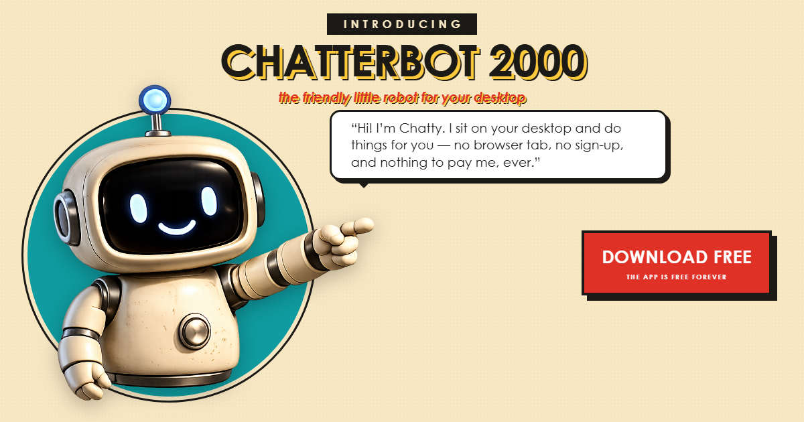
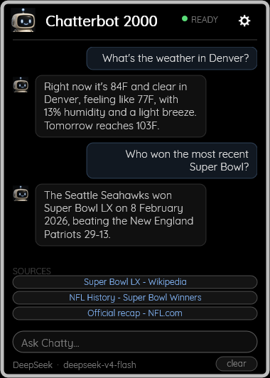
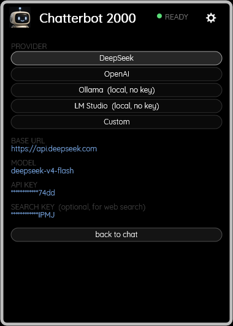

# Chatterbot 2000

**An AI terminal for your desktop.** A Rainmeter skin that talks to any
OpenAI-compatible model — including one running on your own machine.

Ask it something in the bar at the bottom. Chatty answers in place, on the
desktop, without a browser tab or a window stealing your focus.

> **Chatterbot 2000 is a Rainmeter skin, not a standalone program.**
> You need Rainmeter installed first — it is free, open source, and Windows only.
> **Download it here: https://www.rainmeter.net/** (4.5 or newer).

| Conversation | Settings |
|:---:|:---:|
|  |  |

---

## What it does

- **Talks to any OpenAI-compatible provider.** DeepSeek, OpenAI, Groq,
  OpenRouter, Together — and **Ollama** or **LM Studio** running locally.
- **Runs fully local if you want it to.** Pick Ollama or LM Studio in settings
  and there is no API key, no account, and nothing leaves your machine.
- **Live weather.** Real measured conditions and a 3-day forecast for any city,
  from Open-Meteo. No key required, ever.
- **Live web search.** The model decides when it needs to look something up.
  Results appear as **clickable source pills** under the answer.
- **Knows what day it is.** The date goes into every request, so it won't hand
  you a two-year-old result and call it the latest.
- **Collapses to its header** when you want the desktop back. Click the title.

## Install

1. **Install Rainmeter first** if you do not already have it —
   **https://www.rainmeter.net/** (free, open source, Windows only, 4.5+).
   Nothing here works without it.
2. Download the latest `.rmskin` from [Releases](../../releases).
3. Double-click it. Rainmeter's installer does the rest.
4. The status light starts **red** — no provider is configured yet.
5. Click the **gear**, pick a provider, and the light turns **green**.

## Choosing a provider

Click the gear to open settings.

| Provider | Base URL | Key needed |
|---|---|---|
| **Ollama** | `http://localhost:11434/v1` | none |
| **LM Studio** | `http://localhost:1234/v1` | none |
| DeepSeek | `https://api.deepseek.com` | yes |
| OpenAI | `https://api.openai.com/v1` | yes |
| Custom | whatever you type | depends |

Picking a preset fills in its base URL and a sensible default model. For the
cloud providers, click the **API KEY** row and paste your key — it is stored in
`@Resources\config.json` and displayed masked so a screenshot never leaks it.

### Web search (optional)

Search needs a [Tavily](https://tavily.com) key — the free tier is 1,000
searches a month and needs no card. Paste it into the **SEARCH KEY** row.

Without a key there is a DuckDuckGo fallback, but be warned: it works for a
handful of queries and then serves a CAPTCHA. When that happens Chatty says so
plainly and answers from its own knowledge instead of pretending.

Weather never needs a key either way.

## How it works

Four files, one job each.

| File | Owns |
|---|---|
| `Chatterbot 2000.ini` | layout, input, views |
| `@Resources\deepseek.ps1` | the request, the stream, the tool loop |
| `@Resources\tools.ps1` | executing a tool the model asked for |
| `@Resources\chat.lua` | turning the transcript into message bubbles |
| `@Resources\config.ps1` | reading and writing `config.json` |

Tool calls stream: the model can ask for a search mid-answer, the tool runs, and
the reply continues in the same turn. On the last permitted round the tools are
withdrawn so it has to answer with what it found rather than searching forever.

`design.md` documents the decisions and — more usefully — the traps, including
several that cost real debugging time and are not obvious from the code.

## Privacy

- With a **local provider**, nothing leaves your machine. No key, no account.
- With a **cloud provider**, your messages go to that provider and nowhere else.
- Weather calls Open-Meteo with a **place name you typed**, never your location.
- Your keys live in `@Resources\config.json` on your disk. That file is
  excluded from the package and from version control.

## Credits

- Chatty and the panel design: Ryan Heltemes
- [Quicksand](https://fonts.google.com/specimen/Quicksand), copyright 2011 The
  Quicksand Project Authors, used under the SIL Open Font License 1.1 and
  bundled unmodified. See `@Resources\Fonts\OFL.txt`.
- Weather from [Open-Meteo](https://open-meteo.com/), search via
  [Tavily](https://tavily.com).

## Licence

MIT — see [LICENSE](LICENSE).
